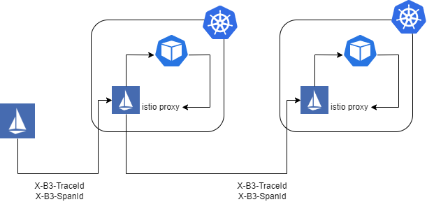
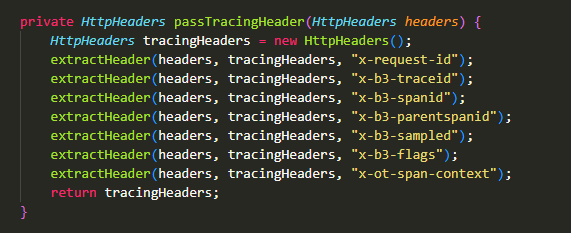

# 1. Overview
- Istio sinh ra các trace span cho mỗi service. Mỗi http request sẽ có các thông tin sau trong headers:
    

- Mỗi request đến từ istio gateway chứa X-B3-SpanId, X-B3-TraceId, X-B3-request-id, X-B3-parentspanid, X-B3-sampled

- Istio không quảng bá các B3 header này trong client request, vậy nên để hệ thống có thể hiểu được trace, ta phải thêm các B3 header này vào request trong code.

- Khác biệt so với sử dụng opentracing là ta chỉ cần chèn thêm header tại một service và headers này sẽ được di chuyển qua các service còn lại giúp ta có được 1 trace hoàn chỉnh
    

# 2. Demo
- Ta có một ứng dụng sử dụng microservice gồm 3 service: billing, eshop, inventory, delivery với http request flow như hình dưới:
    

- header được nhúng tại service eshop và được chuyển qua các service khác tạo thành trace hoàn chỉnh
  

- Kết quả thu được
  